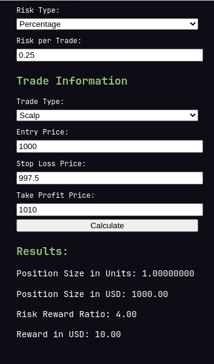

# Risk Management Chrome Extension

This Chrome extension is designed to help traders manage their risk effectively by calculating position size,
risk-reward ratio, and potential reward for various trade types, including swing, intraday, and scalp trades.

## Screenshots

## Features

Custom risk settings for swing, intraday, and scalp trades.
Calculates position size in units and USD based on wallet balance and risk per trade.
Determines the risk-reward ratio and potential reward in USD.
Saves user inputs for convenience.

## Installation

Download the ZIP file of this repository and extract it to a convenient location on your computer.
Open Google Chrome, navigate to chrome://extensions/, and enable "Developer mode" in the top-right corner.
Click on "Load unpacked" and select the extracted folder. The extension should now appear in your Chrome extensions list.

## Usage

Click on the extension icon in the Chrome toolbar to open the popup.
Enter your wallet balance in USD.
Configure the risk settings for swing, intraday, and scalp trades by selecting the risk type (percentage or USD) and entering the risk per trade.
Fill in the trade information, including trade type, entry price, stop-loss price, and take-profit price.
Click "Calculate" to see the results, which include position size in units and USD, risk-reward ratio, and potential reward in USD.

## Localization

The extension supports the following languages: English , German , Spanish , Turkish , Portuguese. To add or update translations, follow these steps:

Navigate to the _locales folder and create a new folder for each language you want to support, using the language's ISO 639-1 code.
In each language folder, create a messages.json file containing key-value pairs for translations. Ensure the keys are the same for all languages and the values are translated accordingly.

## Contributing

Contributions to improve this extension are welcome! If you have suggestions, bug reports, or feature requests, feel free to open an issue or submit a pull request.

## License

This extension is licensed under the MIT License.

## Extension Icon

## Icon Attribute

    <a href="https://www.flaticon.com/free-icons/sales-marketing" title="sales marketing icons">Sales marketing icons created by rukanicon - Flaticon</a>
